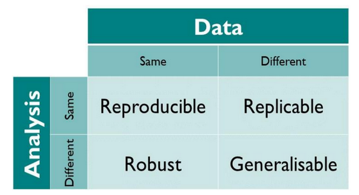
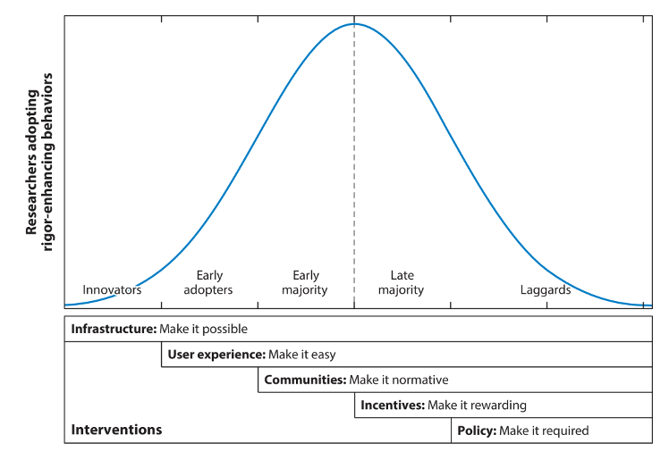

<!-- _class: titlepage -->

# Gérer les expérimentations numériques…
## **…ou comment rendre la recherche plus reproductible**

### ANF Logiciels Libres 2024
#### [Pierre-Antoine Bouttier](mailto:pierre-antoine.bouttier@univ-grenoble-alpes.fr)

---
# D'où je parle

- Ingénieur de recherche CNRS, expert en ingénierie logicielle, spécialisé en mathématiques appliquées, ...
- ...directeur adjoint de **l'UAR GRICAD**, basée à Grenoble, fournissant **services, infrastructures et expertise** en soutien à toutes les communautés de recherche grenobloises autour du **calcul scientifique**, du **développement logiciel** et de la **gestion des données de la recherche**.  
- Je ne suis pas...
  - ...un ASR
  - ...un chercheur en informatique

---
## Préambule

- À qui je m'adresse ?
  - Au plus grand nombre 
  - Grandes hétérogénéités (de public, de pratiques, d'outils, de niveaux de compétences, de culture numérique, *etc.*)

* Ce que je ne présenterai pas 
  - L'épistémologie 
  - Des outils en détail
  - Des méthodes qui garantissent à coups sûr la reproductibilité dans le contexte numérique

---
# TOC

<!-- _class: cool-list -->

1. *La crise de la reproductibilité*
2. *Les expérimentations numériques*
3. *Vers où aller et comment ?*

---
# TOC

<!-- _class: cool-list -->

1. ***La crise de la reproductibilité***
2. *Les expérimentations numériques*
3. *Vers où aller et comment ?*

---
<!-- _class: cite -->

<div class="cite-author" data-text="1,500 scientists lift the lid on reproducibility (Nature, 2016)">

More than 70% of researchers have tried and failed to reproduce another scientist's experiments, and more than half have failed to reproduce their own experiments.

---
# La crise de la  reproductibilité


***1905: Über die von der molekularkinetischen Theorie der Wärme geforderte Bewegung von in ruhenden *by A. Einstein****

* Un seul auteur, raisonnement principalement verbal
* Un étudiant motivé peut vérifier lui-même l'exactitude des calculs

---
# La crise de la  reproductibilité

***2022: Evolutionary-scale prediction of atomic level protein structure with a language model *by Z. Zin & al.****

* 15 auteurs, références à des logiciels
* “[...] we scale language models from 8 million parameters up to **15 billion parameters.**”
* Code et données semblent disponibles... mais peut-on réellement vérifier l'exactitude des calculs ? 
  
---
# Finalement, un peu d'épistémologie...

<div align="center">         
 

<figcaption>
The Turing Way Community (2021).
</figcaption>
   
</div>

---
# ...mais pas trop !


Nous allons parler ici uniquement de reproductibilité
* Le terme est parlant
* C'est la fondation des connaissances scientifiques réplicables et/ou robustes et/ou généralisables


---
# Intérêt de la reproductibilité

Reproductibilité : preuve de **rigueur** qui inspire **confiance**

- Ce qu'un résultat non-reproductible suggère :
  - Une description de la méthodologie incomplète
  - une maîtrise insuffisante des techniques
  - une erreur 
  - une fraude

--- 
# Intérêt de la reproductibilité

Reproductibilité : preuve de **rigueur** qui inspire **confiance**

- L'importance de la confiance
  - pour vous-même
  - pour les sciences (résultats solides et donc féconds)
  - pour l'ensemble de la société

--- 
# Intérêt de la reproductibilité

Reproductibilité : preuve de **rigueur** qui inspire **confiance**

- L'importance de la confiance
  - pour vous-même
  - pour les sciences (résultats solides et donc féconds)
  - pour l'ensemble de la société

***Assurer la reproductibilité de résultats scientifiques est un processus (aux nombreux bénéfices secondaires)***

---
# TOC

<!-- _class: cool-list -->

1. *La crise de la reproductibilité*
2. ***Les expérimentations numériques***
3. *Vers où aller et comment ?*

---
# Quelques cas d'usages

- Statistiques sur une enquête
- Nettoyage, normalisation, etc. de données brutes de mesures
- Simulations numériques
- Calcul de quantités résumantes (*e.g.* stats, courbes), visualisation

---
# Quelques cas d'usages

- Statistiques sur une enquête
- Nettoyage, normalisation, etc. de données brutes de mesures
- Simulations numériques
- Calcul de quantités résumantes (*e.g.* stats, courbes), visualisation

*Points communs de ces **expérimentations numériques** : données numériques & code(s) logiciel(s)*

--- 
# Les traitements numériques 


- Une large majorité des résultats scientifiques repose, aujourd'hui, sur un ***traitement numérique***
- Un résultat scientifique : 
    - Expérience (parfois elle-même numérique)
    - Un **traitement numérique**

--- 
# Les traitements numériques 


- *La reproductibilité d'un traitement numérique* suppose, **a minima** de contrôler
  * Le programme
  * Les données
  * L'environnement

---
**Assurer la reproductibilité de résultats scientifiques est un processus aux nombreux bénéfices secondaires**


---
# TOC

<!-- _class: cool-list -->

1. *La crise de la reproductibilité*
2. *Les expérimentations numériques*
3. ***Vers où aller et comment ?***

---
# Quels outils et quelles pratiques indispensables pour les expérimentations numériques ?

Objectif : dans le **contexte numérique**, nous aider **faire montre de rigueur** à travers une pratique ***transparente***, ***lisible*** et ***accessible*** dans la méthodogie employée pour (re)produire de la connaissance

---
# ~~Open source~~ Logiciels Libres 

* Exigence de **transparence** (et d'**accessibilité**)
* Perennité dans le temps **mieux** assurée (*software heritage*)
* La plupart des logiciels à licence privative ont des **alternatives** (e.g. matlab vs python, intel-compiler vs. gcc)
* **Linux** (et UNIX) : point focal des LL ; Environnement logiciel **aussi** potentiellement libre
* *N'oubliez pas d'aposer une licence logicielle sur votre code source, dès que possible*

--- 
# Transparent ≠ Lisible

```c
m(f,a,s)char*s;
{char c;return f&1?a!=*s++?m(f,a,s):s[11]:f&2?a!=*s++?1+m(f,a,s):1:f&4?a--?
 putchar(*s),m(f,a,s):a:f&8?*s?m(8,32,(c=m(1,*s++,"Arjan Kenter. \no$../.\""),
 m(4,m(2,*s++,"POCnWAUvBVxRsoqatKJurgXYyDQbzhLwkNjdMTGeIScHFmpliZEf"),&c),s)):
 65:(m(8,34,"rgeQjPruaOnDaPeWrAaPnPrCnOrPaPnPjPrCaPrPnPrPaOrvaPndeOrAnOrPnOrP\
nOaPnPjPaOrPnPrPnPrPtPnPrAaPnBrnnsrnnBaPeOrCnPrOnCaPnOaPnPjPtPnAaPnPrPnPrCaPn\
BrAnxrAnVePrCnBjPrOnvrCnxrAnxrAnsrOnvjPrOnUrOnornnsrnnorOtCnCjPrCtPnCrnnirWtP\
nCjPrCaPnOtPrCnErAnOjPrOnvtPnnrCnNrnnRePjPrPtnrUnnrntPnbtPrAaPnCrnnOrPjPrRtPn\
CaPrWtCnKtPnOtPrBnCjPronCaPrVtPnOtOnAtnrxaPnCjPrqnnaPrtaOrsaPnCtPjPratPnnaPrA\
aPnAaPtPnnaPrvaPnnjPrKtPnWaOrWtOnnaPnWaPrCaPnntOjPrrtOnWanrOtPnCaPnBtCjPrYtOn\
UaOrPnVjPrwtnnxjPrMnBjPrTnUjP"),0);}

main(){return m(0,75,"mIWltouQJGsBniKYvTxODAfbUcFzSpMwNCHEgrdLaPkyVRjXeqZh");}

```

---
# Documentation (au sens large)

* Exigence de **lisibilité**
* Du logiciel que vous développez ou que vous utilisez
* Plusieurs formes : description des commandes utilisées, des algorithmes, commentaires dans le code, code lui-même explicite, notebooks, etc. 
  
* *Tout ce qui est **indispensable** pour comprendre et rééxecuter (au niveau de votre logiciel) votre **méthodologie** doit être **explicitée**.*

--- 
# Développement de code : Forge logicielle

* Ensemble d'outils, le plus souvent accessible sur le web, pour gérer et diffuser des codes sources : e.g. **gitlab**, github, bitbucket, etc.
* Basée sur un **gestionnaire de version** (*e.g.* **git**, svn, mercurial)
* Permet de : 
  * gérer son code proprement, de façon collaborative si besoin, le sauvegarder 
  * **De publier du code, de  la documentation** (doc proprement dite, accès au code, site web)
  * De mettre en place, entre autres, des mécanismes des tests automatiques (*intégration continue*, à utiliser avec parcimonie) 
  * **Software Heritage**

--- 
# Mais aussi...

---
# Le choix des outils logiciels pour les développeurs

* Pratiques et outils standards :
  * Compilation : e.g. make, cmake
  * Distribution de votre code : CRAN, pypi 
  * **Respectez les normes/standards !** (codage, empaquetage, etc.)
* Privilégiez les outils qui ont une communauté active...
* ...mais pas au détriment du cahier des charges ! 

---
# Performance et reproductibilité

* **Utilisez les bons outils :** Par exemple, un langage compilé sera souvent plus adapté au besoin de performance qu'un langage interprété
* **Peut rentrer en conflit** avec l'exigence de lisibilité et, parfois, de transparence et/ou d'accessibilité (e.g. compilateur intel, code involontairement obfusqué). 
* **Accentue la dépendance** à l'environnement logiciel et matériel 
* **Effet rebond** : cf. [plaquette dév. log. EcoInfo](https://ecoinfo.cnrs.fr/2020/11/20/plaquette-je-code-les-bonnes-pratiques-en-eco-conception-de-service-numerique-a-destination-des-developpeurs-de-logiciels/)
* Doit répondre à un *réel besoin de performance*

---
# Les notebooks

* Un notebook (interface mélangeant texte, support visuel et code logiciel) : 
  * Est un bon outil pour **expliquer une méthodologie**, présenter des résultats
  * Peut être un bon outil pour reproduire de simples calculs 
  * Peut être une bonne **interface** pour exécuter des calculs
  * N'est pas souvent un bon outil pour *construire et reproduire* une expérimentation numérique (sauf exploration)

---
# Quelques mots sur l'environnement logiciel (open source)


- Données : Open data (e.g. principes FAIR)
- Programme : Open Source, documentation, Forges
- *L'environnement (logiciel) : ?*

---
# Quelques mots sur l'environnement logiciel (open source)

* Crucial pour la reproductibilité computationnelle...
* ...Mais sujet complexe, notamment pour les néophytes (et pas que).
* **Les conteneurs (e.g. docker) ne sont pas la panacée. Ni conda !**
* N'hésitez pas à demander de l'aide sur ces sujets (*e.g.* ITA de labos, GRICAD) !

* [*Présentation de L. Courtès à l'ANF UST4HPC (Guix inside)*](https://www.canal-u.tv/video/groupe_calcul/au_dela_des_conteneurs_environnements_reproductibles_avec_gnu_guix.59571)

---
# TL;DR

Pour **tendre vers une recherche reproductible** dans le contexte numérique, adoptez des pratiques et des outils qui vous aident à respecter : 
* L'exigence de **transparence**
* L'exigence de **lisibilité** 
* L'exigence d'**accessibilité**

---
# TL;DR

Mais ça ne suffit pas !
* Utilisez ces outils rigoureusement : N'hésitez pas à **vous former** !
* Si vous ne savez pas, n'hésitez pas à **demander de l'aide** (par exemple, via [le réseau Recherche Reproductible !](https://www.recherche-reproductible.fr)) 
* ***La rigueur prend du temps...***
* ... Mais les bénéfices scientifiques et techniques sont nombreux ! 

---
# Quid de l'adoption des pratiques ? 

<div align="center">         
 

<figcaption>
Nosek BA, et al. (2022)
</figcaption>
   
</div>


---
<!-- _class: transition -->

# Merci de votre attention !
