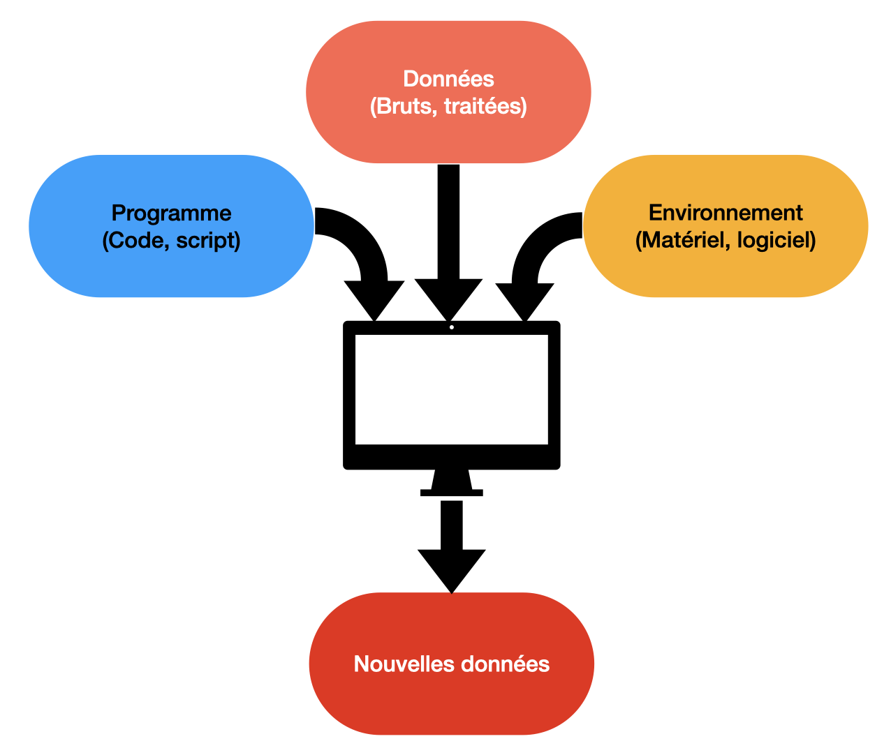
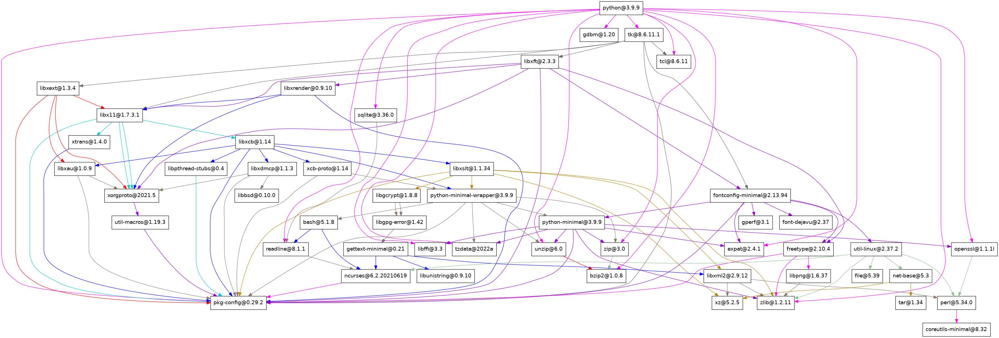

<!-- headingDivider: 2 -->

# Gérer les environnements logiciels avec GUIX...
## **...ou comment rendre reproductible les environnements de calcul**

### Café Guix@JRRR - 27/03/2024
#### L. Courtès & P.-A. Bouttier

---
# Parlons reproductibilité

> More than 70% of researchers have tried and failed to reproduce another scientist's experiments, and more than half have failed to reproduce their own experiments.
> 
> [*1,500 scientists lift the lid on reproducibility (Nature, 2016)*](https://www.nature.com/articles/533452a)

---
# Parlons reproductibilité

> More than 70% of researchers have tried and failed to reproduce another scientist's experiments, and more than half have failed to reproduce their own experiments.
> 
> [*1,500 scientists lift the lid on reproducibility (Nature, 2016)*](https://www.nature.com/articles/533452a)

**La reproductibilité est pourtant l'un des piliers de la méthode scientifique.**

---
# Les traitements numériques 



- Une large majorité des résultats scientifiques repose, aujourd'hui, sur un ***traitement numérique***
- Un résultat scientifique : 
    - Expérience (parfois elle-même numérique)
    - Un **traitement numérique**

---
# Open stuff 


La Science Ouverte, une tautologie ?

* Les données : Open Data 
* Les *programmes* : Open Source
* Les publications : Open Article
* **L'environnement logiciel ?** 

---
# L'environnement logiciel, une importante source de variabilité

* Nous n'avons qu'un contrôle limité sur l'environnemment matériel
* Reproductibilité, réplicabilité, validation, etc. : l'environnement logiciel comme faiseur de roi 

---
# Un programme, vraiment ? 



<!--
Peut-être ajouter l'exemple du code c de Simon
-->

---
# Maîtriser l'environnement logiciel

Contrôler l'environnement logiciel, du moins ses variabilités, revient à maîtriser une machinerie impliquant des millions de rouages, des milliers de concepteurs et dont les plans sont modifiés quotidiennement. 

**Les outils sont indispensables.** 

---
# Aujourd'hui, comment fait-on ?

Les gestionnaires d'environnement logiciels sont nombreux :
* Ceux associés à des systèmes d'exploitations : e.g. `apt-get`, `yum`
* Ceux associés à un langage : `pip`, `npm`, etc. 
* Les "généralistes" : `spack`, `easybuild`, etc
* Ceux faits pour la reproductibilité : `nix`, `guix`. 

---
# Quelques remarques

* La catégorisation précédente n'est pas stricte : un gestionnaire d'env. log. fait souvent plusieurs choses.
* Les conteneurs **ne gèrent pas** un environnement logiciel.
  
---
# Que signifie *faits pour la reproductibilité* ? 

* **Indépendance du système hôte à la construction des binaires**
* **Construction des binaires reproductible**
  * À partir des sources, clairement identifiées...
  * ... suivant des instructions précises...
  * ... pour l'ensemble du graphe de dépendance
* **Indépendance du système hôte à l'exécution des binaires**

---
# Corollaires

Un gestionnaire d'env. log reproductible est également : 
* Très portable 
* Très pratique : *e.g.* multiplicité d'environnement isolé sur un même système

---
# Parlons peu, parlons GUIX 


Qu'est-ce que GUIX ?

* Une distribution GNU/Linux...
* ... mais aussi un gestionnaire d'environnement logiciel **standalone**

---
# Des définitions très simples 

* **Un paquet GUIX** : Une **définition** (=code source, fichier texte brut) de l'ensemble des instructions et dépendances pour installer un logiciel
* **Un channel Guix** : un **dépôt git** contenant **un ensemble de définitions de paquets** (et quelques fichiers de configurations). Un numéro de commit particulier (donc un état bien identifié des définitions) de ce dépôt peut être appelé révision.
  
* Un commit précis d'un channel Guix peut être vu comme un instantané du graphe de dépendances entier (des dizaines de milliers de logiciels empaquetés) !

---
# Comment ça marche (en très gros) ?

* GUIX construit des binaires (exécutables, librairies, fichiers d'include requis, etc.) à partir des instructions contenues dans leurs définitions, dans un répertoire unique `/gnu/store`
* Ensuite, à l'aide de liens symboliques et de positionnement des variables d'environnement (gérés par GUIX), l'utilisateur a accès aux logiciels qui lui sont nécessaires.  

---
# Mais en pratique ? 

Prérequis : 
- Un ordinateur avec les commandes GUIX disponibles (uniquement OS GNU/Linux)
- Une connexion à Internet
- C'est tout. 

---
# Les premiers pas 

Pour chercher un paquet : 
```bash
$ guix search nom_du_logiciel 
```

Pour installer paquet :
```bash
$ guix install nom_du paquet
```

Exemple : 
```
$ guix search numpy
$ guix install python python-numpy
```

---
# Les premiers pas 

En faisant ça, les logiciels sont installés de façon permanente dans votre espace utilisateur (comme avec `conda`, `spack`, *etc*). 

Pour les supprimer : 
```bash
$ guix remove python-numpy
```

Pour lister les paquets installés dans votre espace utilisateur : 
```
guix package -I
```

---
# Mise à jour des channels GUIX et des paquets

GUIX prend ses définitions à partir d'une version donnée d'un ou plusieurs channels GUIX. 

Pour mettre à jour ces définitions, i.e. passer aux derniers **commits** du/des channel(s) GUIX utilisés : 
```
guix pull
```
Pour mettre à jour les paquets déjà installés avec les dernières définitions : 
```
guix upgrade <nom(s) du/des paquet(s)>
```

---
# Décrire tout un environnement logiciel

Si vous connaissez l'ensemble des paquets dont vous avez besoin, vous pouvez écrire un fichier `manifest.scm` qui contiendra les noms des paquets :
```
(specifications->manifest
  (list "python"
        "python-numpy"
        "python-scipy"
        "python-matplotlib"))
```

---
# Décrire tout un environnement logiciel

Les avantages du fichier `manifest.scm`sont nombreux : 
* Description centralisée de tout votre env. log. 
* Fichier que vous pouvez intégrer à votre code, vos scripts...
* ... et aussi versionner !

---
# Décrire tout un environnement logiciel

Les avantages du fichier `manifest.scm`sont nombreux : 
- Description centralisée de tout votre env. log. 
- Fichier que vous pouvez intégrer à votre code, vos scripts...
- ... et aussi versionner !

Pour les pythonistas, pensez au `requirements.txt` mais pour n'importe quel environnement logicel !

---
# Installer tout un environnement logiciel

À partir du `manifest.scm`, déployer l'env. log. tient en une commande : 
```
guix package -m /path/vers/manifest.scm
```

---
# Point d'étape

Maintenant, vous savez...
* ... rechercher, installer, lister et supprimer des paquets GUIX...
* ... et que ce n'est pas très compliqué (pas plus que `conda`, `pip`, `apt-get`, `spack`, *etc.*)
* **Mais comment **je reproduis** cet environnement logiciel ?** 

---
# `guix shell`, une autre façon de déployer un environnement logiciel

Avant de continuer, intéressons-nous à la commande `guix shell`. 

Celle-ci va ouvrir un nouveau shell, incluant l'environnement/les paquets spécifiés. 
```
guix shell -m manifest.scm
```
Cette commande n'installe rien dans votre espace utilisateur, en quittant ce shell, il n'en restera rien. 

---
# `guix shell`, une autre façon de déployer un environnement logiciel

`guix shell` propose différents niveaux d'isolation (basé sur les variables d'environnements) : 
```
# Peu d'isolation du shell hôte
$ guix shell -m manifest.scm

# Niveau plus élevé
$ guix shell --pure -m manifest.scm

# Niveau conteneur
$ guix shell --container -m manifest.scm
```

---
# `guix shell`, une autre façon de déployer un environnement logiciel

Il est tout à fait possible de lancer une commande lors de l'appel à `guix shell` :
```
guix shell -C python python-numpy -- python3 ./mon_script.py
```
Cette commande va exécuter le script python dans l'environnement spécifié et c'est tout ! 

---
# Décrire *complètement* son environnement logiciel

Pour reproduire un env.log. il faut donc le décrire le plus complètement possible. Nous avons vu auparavant le fichier `manifest.scm`. Il manque une information : l'état des définitions/du graphe des dépendances. 

Nous avons vu précdemment qu'en réalité que celui-ci peut être décrit par la **liste des channels GUIX utilisés et leur numéro de commit courant**. GUIX propose une commande qui regroupe toutes ces informations : 
```
guix describe -f channels >> channels.scm
```

---
# Décrire *complètement* son environnement logiciel

**Nous avons maintenant deux fichiers qui décrivent complètement notre env. log.** : `manifest.scm`et `channels.scm`. Nous les rangeons bien au chaud, à côté de notre code, dans son dépôt git. 

---
# Voyage dans l'espace et le temps 


Nous sommes parés. Grâce à la commande `guix time-machine`, nous pouvons reproduire, presque bit-à-bit, notre environnement logiciel !

---
# Reproduire au plus proche son environnement logiciel

Ailleurs, autre part : 

* On clone le dépôt du code (scripts, doc, `manifest.scm`, `channels.scm`)
* On lance la commande suivante : 

---
# Reproduire au plus proche son environnement logiciel

Ailleurs, autre part : 

- On clone le dépôt du code (scripts, doc, `manifest.scm`, `channels.scm`)
- On lance la commande suivante : 

```
guix time-machine -C channels.scm -- shell -C -m manifest.scm
```

* `guix time-machine` donne accès à d'autres révisions de guix et lance la commande `guix` indiquée après `--` dans cette révision. 
* Nous déployons ici bien l'environnement logiciel indiqué dans l'état spécifié. 
* C'est tout !

---
# Et s'il n'y a pas GUIX dans le futur ou sur une autre machine ? 

Une solution : les conteneurs ! 

Sur une machine avec GUIX, nous pouvons créer un conteneur, basé sur l'environnement logiciel déployé avec GUIX, toujours avec `guix time-machine` :

```
guix time-machine -C channels.scm -- pack --format=squashfs -m manifest.scm
```

* Ici, l'image créée est au format reconnu par singularity, on peut créer une image docker-ready ou un simple tar.gz.
* Il reste à la copier sur la machine cible sans `guix` puis à l'exécuter

---
# En résumé

Maintenant, vous savez...
* ... rechercher, installer, lister et supprimer des paquets GUIX,...
* ... créer des env. isolés,...
* ... des images de conteneurs,...
* ... de façon totalement reproductible...
* ... et que ce n'est pas très compliqué (pas plus (voir moins) que `conda`, `spack`, *etc.*)

---
# Le coût de GUIX

* Pour les utilisateurs finaux :
  * Travailler sous GNU/Linux avec où GUIX est disponible
  * Empaquetage des logiciels visés (n'hésitez pas à demander)
  * ?
* Pour les personnels support : 
  * Empaqueter les logiciels (prog. fonctionnelle)
  * ?

---
# Les bénéfices de GUIX

Au-delà de la reproductibilité : 
* Portabilité
* `virtualenv` pour tout type d'env logiciel ! 
* Le voyage dans le temps et l'espace robuste et fiable...
* ...peu importe le système hôte
* Une communauté dynamique, sympa et en plein essor ! (notamment côté calcul scientifique)
* Participer à un projet communautaire
* Plein d'outils ! : Guix Worflow Langage, l'option `--tune`, `guix-jupyter`, **lien avec Software Heritage**, etc. 

---
# Merci à tous pour votre attention ! 

---
# Un paquet guix 

```Scheme
(define-public hello
  (package
    (name "hello")
    (version "2.12.1")
    (source (origin
              (method url-fetch)
              (uri (string-append "mirror://gnu/hello/hello-"$
                                  ".tar.gz"))
              (sha256
               (base32
                "086vqwk2wl8zfs47sq2xpjc9k066ilmb8z6dn0q6ymwj$
    (build-system gnu-build-system)
    (synopsis "Hello, GNU world: An example GNU package")
    (description
     "GNU Hello prints the message \"Hello, world!\" and then$
serves as an example of standard GNU coding practices.")
    (home-page "https://www.gnu.org/software/hello/")
    (license gpl3+)))
```

---
# Cheat codes pour créer un paquet python, R, julia, etc. 

```
guix import pypi --recursive nomDuPaquetPypi
```

---
# Conteneurs et reproductibilité 

2 parties dans les systèmes de conteneurs (*e.g.* docker, singularity):
* La construction de l'image (`docker` ou `singularity` sont plutôt mauvais du point de vue de la reproductibilité)
* L'exécution de l'image