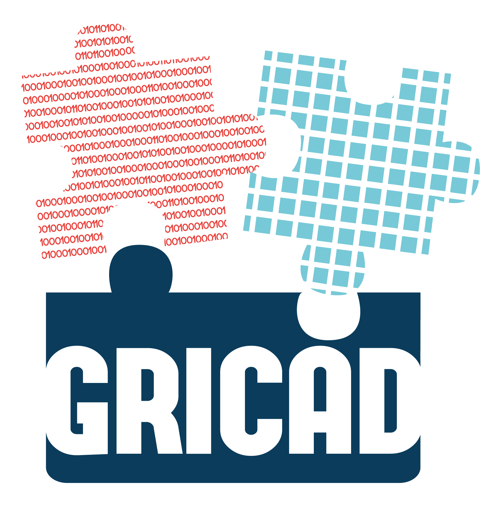

<!-- _transition: cover 0.25s -->

<!-- _class: titlepage -->

# COSTU GRICAD
## Projets, infra et services

### 19 novembre 2024
#### [Pierre-Antoine Bouttier](mailto:pierre-antoine.bouttier@univ-grenoble-alpes.fr), CNRS/[GRICAD](https://gricad.univ-grenoble-alpes.fr)

---

<!-- _transition: none -->

# TOC

<!-- _class: cool-list -->

1. *Tour d'horizon des projets*
2. *Nouveautés des services*
3. *Perspectives*

---
# TOC

<!-- _class: cool-list -->

1. ***Tour d'horizon des projets***
2. *Nouveautés des services*
3. *Perspectives*

---
# Tour d'horizon des projets

GRICAD est impliqué dans de nombreux projets locaux et nationaux :
* Projets d'infrastructures : PIA3 MesoNET, PIA3 Gaia Data
* PEPR : DIADEME (partenaire), NUMPEX (suivi)
* Excellence : GATES
* Et PNRIA, MIAI, projets scientifiques, etc.

---
# Tour d'horizon des projets

GRICAD est impliqué dans de nombreux projets locaux et nationaux :
- Projets d'infrastructures : **PIA3 MesoNET**, PIA3 Gaia Data
- PEPR : DIADEME (partenaire), NUMPEX (suivi)
- Excellence : **GATES**
- Et PNRIA, MIAI, projets scientifiques, etc.

---
# MesoNET : point d'avancement

---
# GATES, point d'avancement

Pool d'ingénieurs GATES constitué en 2024 à 70 % : 5 ingénieurs en février 2024. Objectif : 7 pour le 2nd semestre 2025.
Composition du pool: 1 IR manager, 2 IR et 2 IE sur le traitement des données
Depuis février 2024, 15 projets de recherche SHS soutenus relavant de 12 labos différents
Effort de communication pour s'intégrer aux communautés SHS de l'UGA :
- mise en place d'une gouvernance avec un comité scientifique et un comité de pilotage
- mise en place d'une remontée des besoins annuelle pour cibler les projets sur lesquels travailler
- 5h30 d'accompagnement/explication effectuée en 2024, avec des webinaires et des sessions questions/réponses
- mise en place d'un blog pour illustrer le travail réalisé : blog gates data shs

---
<!-- _class: transition -->

<!-- _transition: cover 0.25s -->

Pourquoi et comment exécuter des notebooks sur les supercalculateurs ?

---
# TOC

<!-- _class: cool-list -->

1. *Tour d'horizon des projets*
2. ***Nouveautés des services***
3. *Perspectives*

---
# Nos infrastructures

---
# Les supercalculateurs

---
<!-- _transition: cover 0.25s -->

# En pratique - Remarques

* Dans l'interface, accès à l'ensemble des espaces de stockage du cluster
* Pour les non-initiés, un peu ardu mais se sytématise bien
* Usage du supercalculateur en mode interactif : **un frein** ?

---
# TOC

<!-- _class: cool-list -->

1. *Tour d'horizon des projets*
2. *Nouveautés des services*
3. ***Perspectives***

---
# JupyterHub@GRICAD

- Accessible à tous les personnels dans le référentiel UGA
- Quota de 20Go de données par utilisateur. Données persistantes.
- Usages : traitements de données légers, développement de notebooks, hébergement de notebooks pour formations, etc.
* Intérêt limité SAUF pour l'enseignement (mais hors périmètre GRICAD...)

---
# HPC en interactif, un usage non-standard

Dus aux mécanismes de réservation de ressources, l'usage interactif d'un cluster HPC peut être compliqué :
- Temps d'attente potentiellement élevés
- Tributaire du créneau d'exécution

---
# Du notebook à la production

<!-- _transition: cover 0.25s -->

* Côté utilisateur
    * Un signe d'extraire le code du notebook pour passer sur un ***projet de développement logiciel à part entière***
    * Permettra d'appliquer des bonnes pratiques de développement logiciel (gestion de version, modularité, maintenance, etc.)

* Côté GRICAD

    * Fournir des solutions simples pour accéder à plus de ressources facilement pour exécuter des notebooks
    * Accompagner les utilisateurs

---

<!-- _class: transition -->

# Merci de votre attention ! Questions ? 
