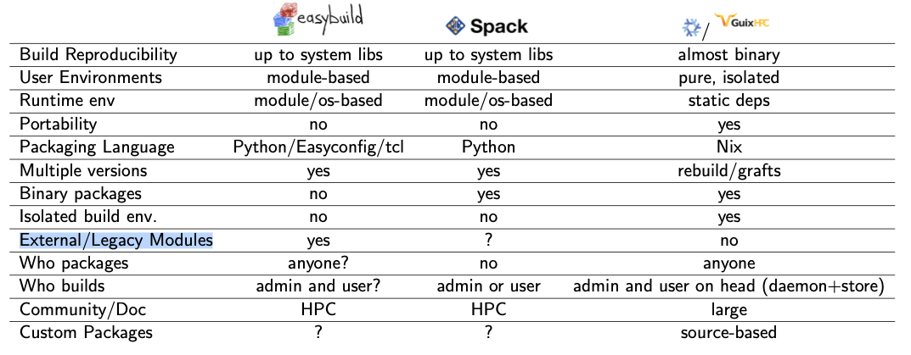

<!-- _class: titlepage -->


# Guix@GRICAD
## **Software packaging and deployment at GriCAD**

### Exa-DI Annuel Meeting - 24/02/2025

#### P.-A. Bouttier

---
# TOC

<!-- _class: cool-list -->

1. *A bit of history*
2. *Guix for users*
3. *Guix for operators*

---
# TOC

<!-- _class: cool-list -->

1. ***A bit of history***
2. *Guix for users*
3. *Guix for operators*

---
# GRICAD supercomputing context

- 4 compute clusters in-house (over 25 000 CPU cores, approximately 100 GPUs)
- ...connected to each other and to lab clusters via a local computing grid
- Uses:
  - HPC, HTC
  - Data processing
  - Visualization, training & development
- **High heterogeneity** in use cases, communities, user skill levels, and consequently, software stacks
- **The challenge**: finding a software environment management tool that meets very heterogeneous constraints

---
# Open Science context

- **Open Science**: How to ensure reproducibility of digital processing?
  - Good software development practices
  - And the software environment?  

- Practice changes
  - Increasing use of non-HPC platforms: JupyterHub, BinderHub, cloud computing...
  - ...within the same processing chain
  - Development of distributed compute/data platforms

---
# The Good Ol' days

- Until 2015, use of the module system
  - Classic, well-known
  - Used at tier-1 and tier-2
  - Usages and communities (many) were more homogeneous

- But issues started to surface:
  - **Very average portability** (essential for our small grid!)
  - **Duplication of effort** proportional to the number of clusters
  - **Marginal community aspect** (e.g. no direct sharing of packages, binaries)
  - ...

---
# The utopia of software environments?

* ***Isolation from the host system***, at execution AND during construction
* **Maintenance** (well-managed dependency tree), **reproducibility** (unique package version - src, compile, desc, defs,... - same output everywhere), **portability**
* **Completely functional in user space**
* **Automated workflow**: custom packages, CI/CD and automatic rebuilds, from personal PC to clusters
* **OS-independent**

---
# Welcome to the Jungle



---
# Our final choices

* Installation and deployment of Nix in 2015, Guix in 2018
* Today, Nix and Guix are available, with some modules for certain users

---
# TOC

<!-- _class: cool-list -->

1. *A bit of history*
2. ***Guix for users***
3. *Guix for operators*

---
# Guix on the user side, Pros and Cons (1/2)

## Cons

- A new tool: requires support (documentation, assistance)
- Support for changes in practices (e.g. detaching from version numbers)
- Some important software stacks still need to be packaged: Intel OneApi, AI frameworks => Nix to the rescue

---
# Guix on the user side, Pros and Cons (2/2)

## Pros

* Reproducible and therefore truly portable (unlike Spack or Conda)
* Very practical for development environments (like `venv`, but for everything)
* Easy-to-use Guix commands
* Large package base (between 20,000 and 50,000 if you add specific channels)
* User autonomous (if package exists)

---
# TOC

<!-- _class: cool-list -->

1. *A bit of history*
2. *Guix for users*
3. ***Guix for operators***

---
# Guix on the support team side, Pros and Cons (1/2)

## Cons

* Steep learning curve for packaging
* Some software, especially proprietary software, is instrinsicly difficult to package

---
# Guix on the support team side, Pros and Cons (2/2)

## Pros

* Greater user autonomy
* A much more portable deployment solution
* Community aspect:
  - sharing packages, recipes, problem-solving
  - Shared documentation
  - Support for support (mailing lists, dedicated Mattermost, Café Guix, Guix-HPC days, etc.)
  - Much more exciting!

---

# Merci à tous pour votre attention ! 

---

# Miscellaneous

---
# Le coût de Guix

* Pour les utilisateurs finaux :
  * Travailler sous GNU/Linux avec où Guix est disponible
  * Empaquetage des logiciels visés (n'hésitez pas à demander)
  * ?
* Pour les personnels support : 
  * Empaqueter les logiciels (prog. fonctionnelle)
  * ?

---
# Les bénéfices de Guix

Au-delà de la reproductibilité : 
* Portabilité
* `virtualenv` pour tout type d'env logiciel ! 
* Le voyage dans le temps et l'espace robuste et fiable...
* ...peu importe le système hôte
* Une communauté dynamique, sympa et en plein essor ! (notamment côté calcul scientifique)
* Participer à un projet communautaire
* Plein d'outils ! : Guix Worflow Langage, l'option `--tune`, `guix-jupyter`, **lien avec Software Heritage**, etc. 

---
# Pour le HPC

* Des channels dédiés, une communauté existante et accueillante (liste de diffusion, mattermost.univ-nantes.fr, café Guix, docs, tutos)
* Partage des recettes de constructions : un gros gain de temps et de ressources
* Des ressources humaines qui peuvent aider (empaquetage, installation, support)

---
# Guix et Mesonet 

* Proposition : 
  * Mise à disposition de Guix, où c'est possible (on peut vous aider)
  * Création d'un channel dédié Mesonet (ou HPC), **tiers de confiance**
  * Documentation mutualisée
  * Formation du GSM 

---
# Quelques liens utiles 

- [La doc de guix](https://guix.gnu.org/manual/devel/fr/guix.fr.html) et [la doc d'instalaltion sur un cluster](https://guix.gnu.org/en/cookbook/en/html_node/Installing-Guix-on-a-Cluster.html)
- [La doc utilisateur GRICAD](https://gricad-doc.univ-grenoble-alpes.fr/hpc/softenv/guix/) 
- [Le channel GRICAD](https://gricad-gitlab.univ-grenoble-alpes.fr/bouttiep/gricad_guix_packages)
- [Le site Guix-HPC](https://hpc.guix.info)
- [Le mattermost Guix-HPC](https://mattermost.univ-nantes.fr/signup_user_complete/?id=njdxbdazafddtq6wsm6cgrr95r)

---
# Comment nous avons mis Guix à disposition à GRICAD ?

- [Première étape : lecture de la doc !](https://guix.gnu.org/en/cookbook/en/html_node/Installing-Guix-on-a-Cluster.html)
- En très bref : 
  - Un noeud principal sur lequel on va installer Guix proprement dit
  - Les noeuds de calcul qui doivent être configurés 

---
# Configurer le noeud principal

Quelques recommandations
* Préférer un serveur dédié, bare-metal 
* Stockage : 
  * un volume RAID avec quelques TB pour être tranquille
  * Des exports NFS
  * Évitez les FS distribués (sensibilité aux stats storm)
* Construction
  * Assez de CPU pour la compilation en parallèle

---
# Configurer le noeud principal : les comptes locaux

* On installe Guix suivant la doc sur ce noeud.
* On créée les utilisateurs chargés de lancer les processus de build : 
```Bash
root@guix:~# grep _guixbuilder /etc/passwd
_guixbuilder0:x:996:996:Guix build user 0:/var/empty:/usr/sbin/nologin
_guixbuilder1:x:995:995:Guix build user 1:/var/empty:/usr/sbin/nologin
_guixbuilder2:x:994:994:Guix build user 2:/var/empty:/usr/sbin/nologin
_guixbuilder3:x:993:993:Guix build user 3:/var/empty:/usr/sbin/nologin
_guixbuilder4:x:992:992:Guix build user 4:/var/empty:/usr/sbin/nologin
_guixbuilder5:x:991:991:Guix build user 5:/var/empty:/usr/sbin/nologin
_guixbuilder6:x:990:990:Guix build user 6:/var/empty:/usr/sbin/nologin
_guixbuilder7:x:989:989:Guix build user 7:/var/empty:/usr/sbin/nologin
_guixbuilder8:x:988:988:Guix build user 8:/var/empty:/usr/sbin/nologin
_guixbuilder9:x:987:987:Guix build user 9:/var/empty:/usr/sbin/nologin
```
---
# Configurer le noeud principal : le démon Guix

Editer `/etc/systemd/system/guix-daemon.service` :

```
ExecStart=/var/guix/profiles/per-user/root/current-guix/bin/guix-daemon \
        --build-users-group=guixbuild \
        --listen=/var/guix/daemon-socket/socket \
        --listen=0.0.0.0

# The --listen=0.0.0.0 option will make the daemon 
# listen to all your networks (you may restrict to some local network interface)
```

---
# Configurer le noeud principal : les exports NFS

* `/gnu/store *(ro)` : Big storage **read-only**
* `/var/guix *(rw, async)` : User profiles r/w
* `/var/log/guix *(ro)` : Logs from the daemon

---
# Les noeuds de calcul

Montage des répertories Guix : 
```
head-node:/gnu/store    /gnu/store    nfs  defaults,_netdev,vers=3 0 0
head-node:/var/guix     /var/guix     nfs  defaults,_netdev,vers=3 0 0
head-node:/var/log/guix /var/log/guix nfs  defaults,_netdev,vers=3 0 0
```

---
# Les noeuds de calcul : un env Guix minimal

`$ source /applis/site/guix.sh`

```
export GUIX_PROFILE=$HOME/.guix-profile/
export GUIX_USER_PROFILE_DIR=/var/guix/profiles/per-user/$USER 
export GUIX_DAEMON_SOCKET="guix://head-node"
export PATH=/var/guix/profiles/per-user/root/current-guix/bin:$PATH
export GUIX_LOCPATH=/var/guix/profiles/per-user/root/guix-profile/lib/locale
export USERGUIXPATH=$HOME/.config/guix/current                 
export INFOPATH="$USERGUIXPATH/share/info:$INFOPATH"           
source $USERGUIXPATH/etc/profile                               
source $USERGUIXPATH/etc/bash_completion.d/guix 
```

The very minimal should be:
- guix command in the PATH of the users
- GUIX_DAEMON_SOCKET set to the master host (guix-daemon)

---
# Au niveau réseau

- Le noeud principal agit comme un proxy pour les noeuds de calcul
- Il doit avoir accès au moins à https://ci.guix.gnu.org 
- Il doit avoir accès également aux fichiers sources des paquets qui ne sont pas pré-construits, mais possible de le faire offline (cf. https://guix.gnu.org/cookbook/fr/html_node/Acces-reseau-de-la-grappe.html)

---

# Un paquet guix 

```Scheme
(define-public hello
  (package
    (name "hello")
    (version "2.12.1")
    (source (origin
              (method url-fetch)
              (uri (string-append "mirror://gnu/hello/hello-"$
                                  ".tar.gz"))
              (sha256
               (base32
                "086vqwk2wl8zfs47sq2xpjc9k066ilmb8z6dn0q6ymwj$"
    (build-system gnu-build-system)
    (synopsis "Hello, GNU world: An example GNU package")
    (description
     "GNU Hello prints the message \"Hello, world!\" and then serves as an example of standard GNU coding practices.")
    (home-page "https://www.gnu.org/software/hello/")
    (license gpl3+)))
```

---
# Cheat codes pour créer un paquet python, R, julia, etc. 

```
guix import pypi --recursive nomDuPaquetPypi
```

---
# Conteneurs et reproductibilité 

2 parties dans les systèmes de conteneurs (*e.g.* docker, singularity):
* La construction de l'image (`docker` ou `singularity` sont plutôt mauvais du point de vue de la reproductibilité)
* L'exécution de l'image

--- 
# Le Garbage Collector de Guix

Le garbage collector de Guix va vérifier l'ensemble des profiles pour savoir quels paquets (rép. `/gnu/store`) ne sont plus utilisés et les supprimer. 

```
$ guix gc 
```

---
# La sécurité

Pour tracker les librairies compromises, par exemple, pour la glibc 2.25 avant corrections : 
```
guix gc --referrers /gnu/store/...-glibc-2.25
```
