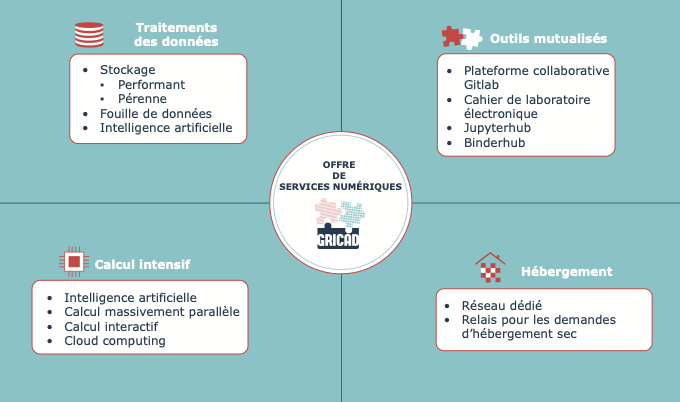
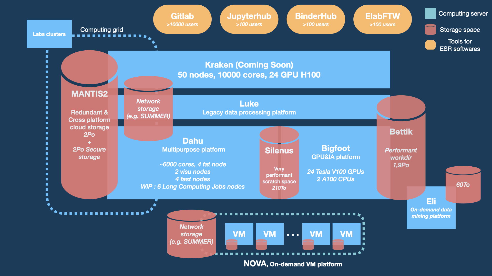
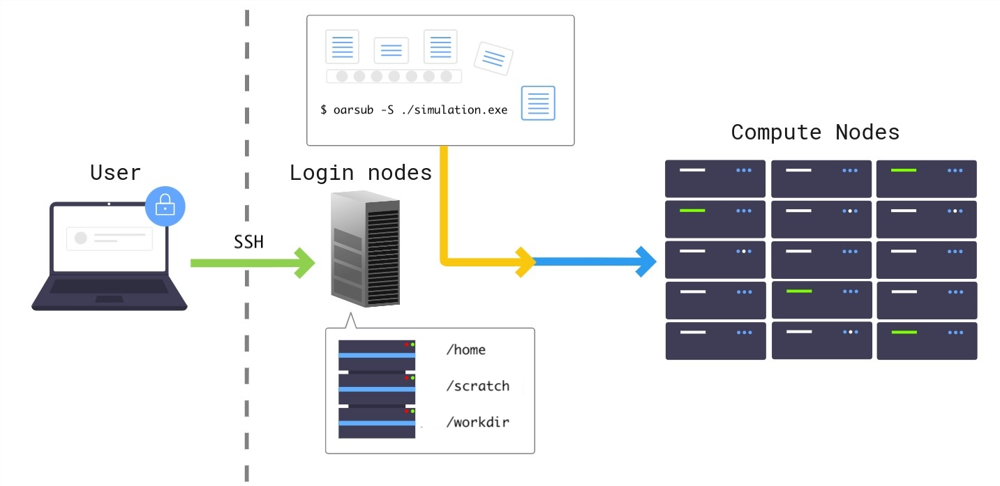

<!-- _transition: cover 0.25s -->

<!-- _class: titlepage -->


# Jupyter@GRICAD
## Comment travailler avec des notebooks dans un mésocentre de calcul ?

### Webinaire GT notebooks, 04/10/2024
#### [Pierre-Antoine Bouttier](mailto:pierre-antoine.bouttier@univ-grenoble-alpes.fr), CNRS/[GRICAD](https://gricad.univ-grenoble-alpes.fr)

---

<!-- _transition: none -->

# TOC

<!-- _class: cool-list -->

1. *GRICAD & Jupyter*
3. *Jupyter sur un supercalculateur*
4. *Remarques sur les notebooks et le HPC*

---
# TOC

<!-- _class: cool-list -->

1. ***GRICAD & Jupyter***
3. *Jupyter sur un supercalculateur*
4. *Remarques sur les notebooks et le HPC*

---
# Les missions de GRICAD

- **Accompagnement, conseils et formations** aux chercheurs sur leurs besoins liés au calcul scientifique, aux données de la recherche
- Mise à disposition **de services et d'infrastructures avancés et mutualisés** pour le calcul intensif et l’exploitation des données de la recherche...
- ...**Librement accessibles**, à destination de l'ensemble des **communautés de recherche grenobloises et de leurs collaborateurs**

---
# Notre offre de services numériques

<div align="center">



</div>

---
# JupyterHub@GRICAD

- Accessible à tous les personnels dans le référentiel UGA
- Quota de 20Go de données par utilisateur. Données persistantes.
- Usages : traitements de données légers, développement de notebooks, hébergement de notebooks pour formations, etc.
* Intérêt limité SAUF pour l'enseignement (mais hors périmètre GRICAD...)

---
# Le cloud computing

- Plateforme Openstack permettant de fournir des VM à la demande avec ressources ajustables (RAM, vCPU, éventuellement vGPUs)
- Possibilité d'avoir des centaines de GO, des dizaines de Go de RAM/vCPU et un vGPU.
- Installation et maintenance de la VM à charge des utilisateurs : JupyterLab/Hub, administration de la/des VM(s)
* Usages beaucoup plus diversifiés (en terme de ressources mais aussi de périmètre)
* ...au prix de plus d'efforts côté utilisateurs

---
# Les supercalculateurs

2 principaux clusters :
- ***Dahu***, orienté HPC classique, traitement massif de données
- ***Bigfoot***, orienté IA/calcul sur GPU.

<div align="center">



</div>

---
<!-- _class: transition -->

<!-- _transition: cover 0.25s -->

Pourquoi et comment exécuter des notebooks sur les supercalculateurs ?

---
# TOC

<!-- _class: cool-list -->

1. *GRICAD & Jupyter*
3. ***Jupyter sur un supercalculateur***
4. *Remarques sur les notebooks et le HPC*

---
# Utilisation d'un supercalculateur

<div align="center">



</div>

---
# Pourquoi exécuter des notebooks sur un supercalculateur ?

* Pour accéder à plus de ressources pour exécuter le code du notebook !
* Tester, développer, reproduire, etc...
* ...Notamment pour les utilisateurs peu avertis en développement logiciel

---
# En pratique - Installation et configuration de jupyter

- Une fois sur le noeud de login, besoin d'installer l'environnement logiciel
- À GRICAD, Guix est disponible

```sh
[user@f-dahu ~]$ guix install jupyter
[user@f-dahu ~]$ jupyter notebook --generate-config
[user@f-dahu ~]$ echo "c.NotebookApp.open_browser = False" >> ~/.jupyter/jupyter_notebook_config.py
[user@f-dahu ~]$ echo "c.NotebookApp.ip = '0.0.0.0'" >> ~/.jupyter/jupyter_notebook_config.py
```

* A ne faire qu'une seule fois !

---
# En pratique - Lancement du job interactif

```sh
[user@f-dahu ~]$ oarsub -I --project test -l /core=1,walltime=2:00:00
[ADMISSION RULE] Modify resource description with type constraints
OAR_JOB_ID=14181444
Interactive mode : waiting...
[...]
Starting...

Initialize X11 forwarding...
Connect to OAR job 14181444 via the node dahu38
```

---
# En pratique - exécution de jupyter sur les noeuds de calcul

```sh
[user@dahu38 ~]$ source /applis/site/guix-start.sh
[user@dahu38 ~]$ jupyter notebook
[I 15:48:01.768 NotebookApp] Writing notebook server cookie secret to /home/user/.local/tmp/jupyter/notebook_cookie_secret
[I 15:48:09.697 NotebookApp] Serving notebooks from local directory: /home/user
[I 15:48:09.697 NotebookApp] The Jupyter Notebook is running at:
[I 15:48:09.697 NotebookApp] http://(dahu38 or 127.0.0.1):8888/?token=524bfbd752f764ef447509bde0a5d8f9169ab603ce33f966
[I 15:48:09.697 NotebookApp] Use Control-C to stop this server and shut down all kernels (twice to skip confirmation).
[C 15:48:09.727 NotebookApp]

    To access the notebook, open this file in a browser:
        file:///home/user/.local/tmp/jupyter/nbserver-276827-open.html
    Or copy and paste one of these URLs:
        http://(dahu38 or 127.0.0.1):8888/?token=524bfbd752f764ef447509bde0a5d8f9169ab603ce33f966
```

---
# En pratique - Ouvrir Jupyter dans un navigateur

Création d'un tunnel SSH sur le poste de travail utilisateur :

```sh
[user@workstation ~]$ ssh -fNL 8889:dahu38:8888 dahu.ciment
```

Ouverture de l'interface

```sh
http://localhost:8889/?token=524bfbd752f764ef447509bde0a5d8f9169ab603ce33f966
```

---

<!-- _transition: cover 0.25s -->

# En pratique - Remarques

* Dans l'interface, accès à l'ensemble des espaces de stockage du cluster
* Pour les non-initiés, un peu ardu mais se sytématise bien
* Usage du supercalculateur en mode interactif : **un frein** ?

---
# TOC

<!-- _class: cool-list -->

1. *GRICAD & Jupyter*
3. *Jupyter sur un supercalculateur*
4. ***Remarques sur les notebooks et le HPC***

---
# HPC en interactif, un usage non-standard

Dus aux mécanismes de réservation de ressources, l'usage interactif d'un cluster HPC peut être compliqué :
- Temps d'attente potentiellement élevés
- Tributaire du créneau d'exécution

---
<!-- _transition: cover 0.25s -->

# Du notebook à la production

* Devoir exécuter un notebook sur un cluster HPC == besoin de production (plus) massive de données/résultats.
* Que faire ?

* Côté utilisateur
    * Une signe d'extraire le code du notebook pour passer sur un ***projet de développement logiciel à part entière***
    * Permettra d'appliquer des bonnes pratiques de développement logiciel (gestion de version, modularité, maintenance, etc.)

* Côté GRICAD

    * Fournir des solutions simples pour accéder à plus de ressources facilement pour exécuter de snotebooks
    * Accompagner les utilisateur

---

<!-- _class: transition -->

## Quid de la reproductibilité de l'environnement logiciel ?
# Merci de votre attention !
